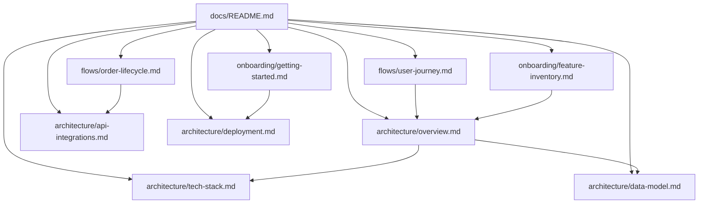

# Design Document: Project Documentation

## Overview

This feature produces a structured set of markdown documentation files for the ShapeMint platform. The documentation is generated by analyzing the existing codebase — schema SQL, Edge Functions, frontend services/pages, blender-service, and configuration files — and writing comprehensive markdown files into a `docs/` directory hierarchy.

The documentation serves three audiences:
1. **Diagram creators** — architecture and data model descriptions written to be directly translatable into Excalidraw diagrams
2. **Video producers** — user journey and feature inventory content suitable for explainer/marketing video scripts
3. **New developers** — onboarding guide and tech stack reference for day-one productivity

The feature is a one-time generation task (with future manual updates) that produces static markdown files. It does not introduce new runtime code, APIs, or database changes.

## Architecture

### System Context

The documentation generator is a **development-time authoring task**, not a runtime service. It reads from the existing codebase and produces markdown files. No new services, APIs, or infrastructure are introduced.

```
┌─────────────────────────────────────────────────────────┐
│                   ShapeMint Repository                    │
│                                                          │
│  ┌──────────────┐    reads     ┌──────────────────────┐ │
│  │ Source Code   │◄────────────│  Documentation       │ │
│  │ • schema.sql  │             │  Generation Process  │ │
│  │ • Edge Fns    │             │  (developer + AI)    │ │
│  │ • frontend/   │             └──────────┬───────────┘ │
│  │ • blender-svc │                        │             │
│  │ • package.json│                writes  ▼             │
│  └──────────────┘             ┌──────────────────────┐ │
│                                │  docs/               │ │
│                                │  ├── architecture/   │ │
│                                │  ├── flows/          │ │
│                                │  ├── onboarding/     │ │
│                                │  └── README.md       │ │
│                                └──────────────────────┘ │
└─────────────────────────────────────────────────────────┘
```

### Design Decisions

1. **Manual generation over automated CI** — Documentation is authored once and updated manually. An automated generator would require maintaining a parser that understands the codebase structure, which adds complexity without proportional value for a project of this size.

2. **Coexistence with existing docs/** — The existing `docs/` directory contains API references (`docs/API_information/`), schema backups (`docs/supabase-backup/`), UI notes (`docs/UI/`), SQL snippets (`docs/sql-snippets/`), and standalone files (`phase2_shapeways_finishing_touches.md`, `phase3_high_level_overview.md`). New documentation is placed in subdirectories (`architecture/`, `flows/`, `onboarding/`) to avoid conflicts.

3. **Excalidraw-ready descriptions** — Each diagram-worthy section includes a text-based description with labeled boxes and arrows, so a reader can recreate the diagram in Excalidraw without additional research.

4. **Single source of truth** — The documentation references `docs/supabase-backup/schema.sql` as the canonical schema (matching the convention in CLAUDE.md) rather than duplicating schema details that could drift.

## Components and Interfaces

### Output File Structure

```
docs/
├── README.md                          (index with links to all docs)
├── architecture/
│   ├── overview.md                    (services, connections, pipelines)
│   ├── tech-stack.md                  (languages, frameworks, services)
│   ├── data-model.md                  (tables, relationships, RLS)
│   ├── api-integrations.md            (vendor APIs, auth, endpoints)
│   └── deployment.md                  (hosting, env vars, local dev)
├── flows/
│   ├── user-journey.md                (end-to-end user flows)
│   └── order-lifecycle.md             (order states, vendor mapping)
├── onboarding/
│   ├── getting-started.md             (local setup, conventions)
│   └── feature-inventory.md           (feature catalog by domain)
├── API_information/                   (pre-existing, preserved)
├── supabase-backup/                   (pre-existing, preserved)
├── UI/                                (pre-existing, preserved)
├── sql-snippets/                      (pre-existing, preserved)
├── phase2_shapeways_finishing_touches.md  (pre-existing, preserved)
└── phase3_high_level_overview.md         (pre-existing, preserved)
```

### Document Dependencies



### Content Sources per Document

| Document | Primary Sources |
|----------|----------------|
| `architecture/overview.md` | CLAUDE.md, frontend/src/services/, frontend/supabase/functions/, blender-service/ |
| `architecture/tech-stack.md` | frontend/package.json, blender-service/requirements.txt, frontend/supabase/functions/deno.json |
| `architecture/data-model.md` | docs/supabase-backup/schema.sql |
| `architecture/api-integrations.md` | docs/API_information/*, frontend/supabase/functions/vendor-* |
| `architecture/deployment.md` | CLAUDE.md, frontend/proxy-server.js, frontend/api/, .env (structure only) |
| `flows/user-journey.md` | frontend/src/pages/, frontend/src/hooks/, frontend/src/services/ |
| `flows/order-lifecycle.md` | schema.sql (orders table), vendor Edge Functions, docs/API_information/ |
| `onboarding/getting-started.md` | CLAUDE.md, package.json, .env (structure only) |
| `onboarding/feature-inventory.md` | All source directories, NEXT_STEPS.md, existing docs |

### README.md Structure

The index file contains:
- A one-line project description
- A table of contents with relative links to each new document (9 files)
- A "Legacy Documentation" section with relative links to each pre-existing directory and file (6 items)
- Each link accompanied by a description ≤120 characters

## Data Models

This feature does not introduce new database tables, types, or runtime data structures. The output is static markdown files committed to the repository.

### Document Metadata Convention

Each generated markdown file follows this structure:
```markdown
# [Document Title]

> Last updated: YYYY-MM-DD | Source of truth: [reference file]

## [Section 1]
...
```

The "Source of truth" reference helps future maintainers know which codebase artifact to check when updating the document.

## Correctness Properties

*A property is a characteristic or behavior that should hold true across all valid executions of a system — essentially, a formal statement about what the system should do. Properties serve as the bridge between human-readable specifications and machine-verifiable correctness guarantees.*

Randomized input generation (PBT) does not apply to this feature. The output is static markdown documentation files authored by analyzing the existing codebase. There are no pure functions, parsers, serializers, data transformations, or algorithmic logic that would benefit from PBT.

**Why PBT is inappropriate here:**
- The feature produces prose content, not computed values
- There is no input space to randomize — documents are written once from fixed source material
- Correctness is defined by human-reviewable content accuracy, not by invariants over inputs

The following structural properties can be verified via scripting or manual review:

### Property 1: File existence completeness

*For any* target file path defined in Requirement 1.1, that file SHALL exist in the repository after documentation generation is complete.

**Validates: Requirements 1.1**

### Property 2: README link validity

*For any* relative markdown link in `docs/README.md`, the referenced file SHALL exist at the resolved path within the repository.

**Validates: Requirements 1.4**

### Property 3: Pre-existing file preservation

*For any* file in `docs/` that is not one of the 9 target paths or `docs/README.md`, the file SHALL remain unmodified after documentation generation (zero diff).

**Validates: Requirements 1.3**

### Property 4: Document metadata presence

*For any* generated documentation file, the file SHALL contain a level-1 markdown heading and a "Source of truth" reference line.

**Validates: Requirements 1.1, 2.1, 3.1, 4.1**

Note: These properties are best validated with a shell script (for structural checks) and manual review (for content accuracy). They are expressed in universal quantification form for traceability but do not require a PBT library to verify.

## Error Handling

Since this is a documentation authoring task (not runtime code), traditional error handling does not apply. However, the following failure modes are addressed:

| Scenario | Mitigation |
|----------|-----------|
| Target file already exists | Overwrite with new content (per Requirement 1.2) |
| Pre-existing docs/ content | Never modify files outside the 9 target paths + README.md (per Requirement 1.3) |
| Schema changes after docs written | Each document references its source of truth; staleness is visible |
| Missing information in codebase | Document marks gaps with `<!-- TODO: ... -->` comments for future completion |
| Version drift in package.json | Tech stack document notes that versions should be updated alongside dependency bumps (per Requirement 3.7) |

## Testing Strategy

**PBT does not apply to this feature.** The feature produces static markdown documentation files. There are no pure functions, data transformations, or algorithmic logic to validate with property-based testing. The outputs are prose content, not computed values.

### Appropriate Testing Approach

**Manual review and structural validation:**

1. **Structure verification** — Confirm all 9 target files + README.md exist at the correct paths after generation
2. **Link validation** — Verify all relative links in README.md resolve to existing files
3. **Content completeness** — Review each document against its acceptance criteria checklist
4. **Preservation check** — Confirm pre-existing files in `docs/` are unmodified (git diff shows no changes to `docs/API_information/`, `docs/supabase-backup/`, `docs/UI/`, `docs/sql-snippets/`, or standalone files)
5. **Accuracy spot-check** — Cross-reference key claims (table names, Edge Function names, version numbers) against the actual codebase

### Validation Checklist per Document

| Document | Key Validations |
|----------|----------------|
| `overview.md` | All 6 services listed, connections described, both pipelines documented |
| `tech-stack.md` | Version numbers match package.json, all vendors listed |
| `data-model.md` | All 15 tables documented, RLS policies listed, ER summary present |
| `api-integrations.md` | All 5 vendors + Meshy + fal.ai + Stripe + Modal covered |
| `deployment.md` | Env vars listed (no secrets), local setup steps work |
| `user-journey.md` | 4 flows documented with page/component/service references |
| `order-lifecycle.md` | State machine complete, vendor status mapping present |
| `getting-started.md` | Setup steps reproducible on a fresh clone |
| `feature-inventory.md` | Features categorized by domain, status assigned |

### Automation Opportunity

A simple shell script can validate the structural requirements:
```bash
#!/bin/bash
# Verify all required documentation files exist
files=(
  "docs/README.md"
  "docs/architecture/overview.md"
  "docs/architecture/tech-stack.md"
  "docs/architecture/data-model.md"
  "docs/architecture/api-integrations.md"
  "docs/architecture/deployment.md"
  "docs/flows/user-journey.md"
  "docs/flows/order-lifecycle.md"
  "docs/onboarding/getting-started.md"
  "docs/onboarding/feature-inventory.md"
)
for f in "${files[@]}"; do
  [ -f "$f" ] && echo "✅ $f" || echo "❌ MISSING: $f"
done
```

This script can be run post-generation to confirm file creation without needing a full test framework.
